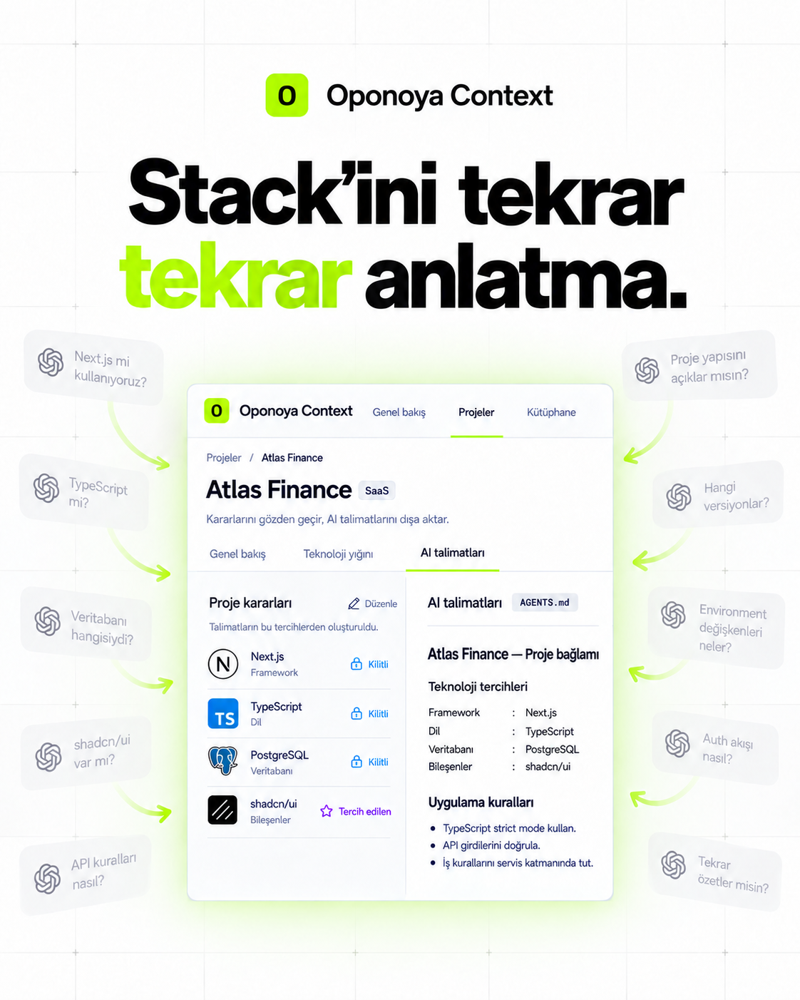
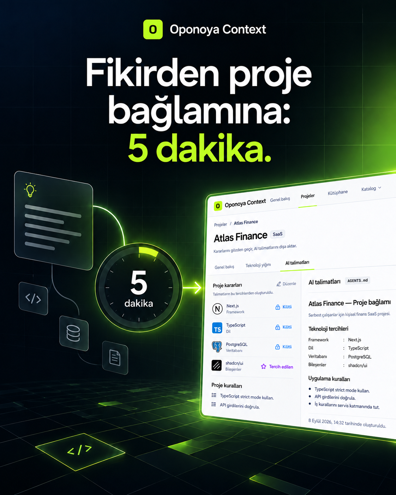
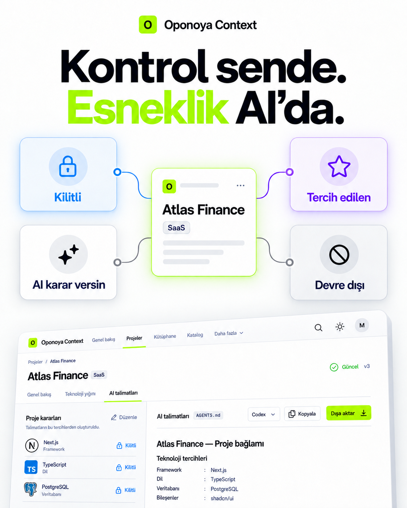
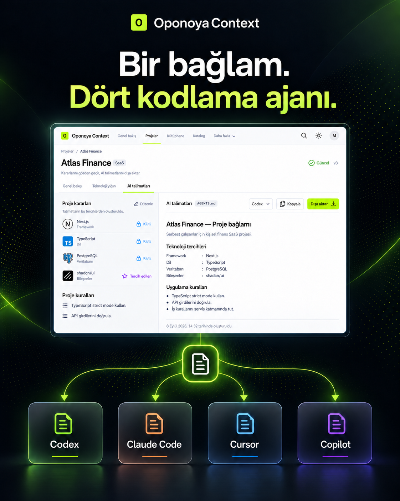
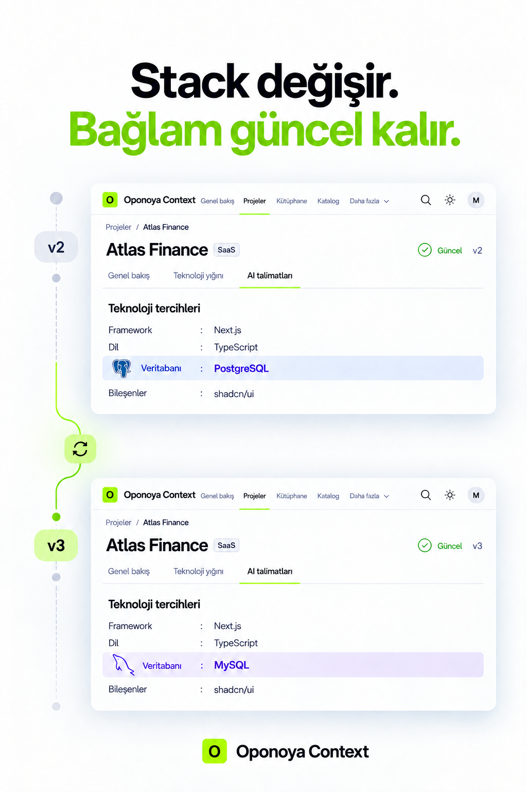

# Oponoya Context sosyal medya içerik paketi

Bu paket, geliştiriciler, teknik liderler, yazılım ekipleri ve AI ile ürün geliştiren kurucular için hazırlanmıştır. Ana mesaj: **Teknolojilerini bir kez anlat. Her projede hatırlansın.**

Görseller 4:5 dikey formatta üretildi. Instagram ve LinkedIn organik akışlarında, ayrıca Meta akış reklamlarında doğrudan kullanılabilir. Instagram Hikâyeleri için metinleri 9:16 şablona yerleştirirken ana ürün kartını orta güvenli alanda tutun.

> Marka adı bu kampanya için **Oponoya Context** olarak uygulanmıştır.

## 1. Stack’ini tekrar tekrar anlatma

**Amaç:** Problem farkındalığı ve marka tanıtımı  
**Hedef kitle:** AI kodlama araçlarını kullanan geliştiriciler, freelancer’lar, teknik kurucular

### LinkedIn gönderisi

Her yeni projede aynı şeyleri yeniden mi yazıyorsun?

“Next.js kullan.”  
“TypeScript strict mode açık olsun.”  
“API girdilerini doğrula.”  
“İş kurallarını servis katmanında tut.”

Kodlama ajanları hız kazandırıyor. Fakat proje bağlamı dağınıksa ekip aynı kararları tekrar tekrar anlatıyor.

Oponoya Context; teknoloji yığınını, mimari tercihlerini ve çalışma kurallarını tek yerde saklar. Ardından bunları proje bazında net, yeniden kullanılabilir AI talimatlarına dönüştürür.

Teknolojilerini bir kez anlat. Her projede hatırlansın.

**CTA:** Çalışma alanını oluştur.

### Instagram gönderisi

Her projede aynı stack’i baştan anlatmak zorunda değilsin. ⚡

Araçlarını, tercihlerini ve kurallarını Oponoya Context’e kaydet. Projene uygun bağlamı oluştur ve kodlama ajanına aktar.

Bir kez tanımla. Her projede kullan.

**CTA:** Profili ziyaret et / Çalışma alanını oluştur.

### Instagram Hikâyesi — 3 kare

1. **Her yeni projede aynı şeyleri yeniden mi anlatıyorsun?**  
   Anket: “Evet, sürekli” / “Maalesef evet”
2. **Stack’in + tercihlerin + kuralların tek yerde.**  
   Alt metin: “Projene göre düzenle.”
3. **Bir kez anlat. Her projede hatırlansın.**  
   Bağlantı etiketi: “Oponoya Context’i keşfet”

### Reklam

**Ana metin:** Kodlama ajanına her projede aynı teknoloji yığınını ve kuralları tekrar anlatma. Oponoya Context ile geliştirme tercihlerini tek yerde sakla, proje bağlamına dönüştür ve çalıştığın ajana aktar.  
**Başlık:** Stack’ini tekrar tekrar anlatma.  
**Açıklama:** Tek bir geliştirici bağlamı. Her proje için net talimatlar.  
**CTA düğmesi:** Daha Fazla Bilgi

**Hashtag:** #OponoyaContext #YapayZeka #YazılımGeliştirme #DeveloperTools #SaaS

---

## 2. Fikirden proje bağlamına: 5 dakika

**Amaç:** Ürün değerini somutlaştırmak  
**Hedef kitle:** Hızlı prototip geliştiren kurucular, indie hacker’lar, ajans ekipleri

### LinkedIn gönderisi

Bir proje fikri birkaç dakikada doğuyor. Onu geliştirecek AI’a doğru bağlamı vermek ise çoğu zaman daha uzun sürüyor.

Oponoya Context’in akışı basit:

1. Teknolojilerini ve kurallarını kütüphanene kaydet.
2. Hazır profil ve tariflerini seç.
3. Projeye özel kararlarını belirle.
4. Bağlamı oluştur ve dışa aktar.

Hedefimiz, “Next.js tabanlı bir SaaS kurmak istiyorum” fikrinden temiz ve yeniden kullanılabilir proje talimatlarına 5 dakikadan kısa sürede ulaşmanı sağlamak.

**CTA:** İlk proje bağlamını oluştur.

### Instagram gönderisi

Fikir hazır. Stack belli. Peki AI’ın ihtiyaç duyduğu bağlam? ⏱️

Oponoya Context ile profilini seç, proje kararlarını belirle ve talimatlarını dakikalar içinde dışa aktar.

Fikirden proje bağlamına: 5 dakika.

**CTA:** Çalışma alanını oluştur.

### Instagram Hikâyesi — 3 kare

1. **Proje fikrin hazır mı?**  
   Soru etiketi: “Ne geliştiriyorsun?”
2. **Stack + profil + kurallar**  
   Alt metin: “Tek akışta birleştir.”
3. **5 dakikada proje bağlamı**  
   Bağlantı etiketi: “Şimdi oluştur”

### Reklam

**Ana metin:** Proje fikrini kodlama ajanının anlayacağı net talimatlara dönüştür. Stack’ini seç, kurallarını ekle ve yeniden kullanılabilir proje bağlamını dakikalar içinde oluştur.  
**Başlık:** Fikirden proje bağlamına: 5 dakika.  
**Açıklama:** Daha az kurulum, daha hızlı başlangıç.  
**CTA düğmesi:** Kaydol

**Hashtag:** #BuildInPublic #IndieHacker #AIEngineering #Yazılım #DevTools

---

## 3. Kontrol sende. Esneklik AI’da.

**Amaç:** Karar modelini anlatmak ve güven oluşturmak  
**Hedef kitle:** Tech lead’ler, senior geliştiriciler, standartları olan yazılım ekipleri

### LinkedIn gönderisi

Bir kodlama ajanına özgürlük vermek faydalı. Her kararı ona bırakmak ise her proje için doğru değil.

Oponoya Context’te her teknoloji ve kural için niyetini açıkça belirleyebilirsin:

- **Kilitli:** AI bu seçimi değiştiremez.
- **Tercih edilen:** Gerekli olduğunda alternatif önerebilir.
- **AI karar versin:** Bağlama göre en uygun seçimi yapabilir.
- **Devre dışı:** Bu projede kullanılmaz.

Böylece ekip standartları korunur, AI’ın yararlı olduğu alanlarda esneklik devam eder ve her karar incelenebilir kalır.

**CTA:** Proje kararlarını tanımla.

### Instagram gönderisi

AI neyi seçebilir, neyi değiştiremez? Kararı sen ver. 🔒✨

Kilitli. Tercih edilen. AI karar versin. Devre dışı.

Oponoya Context ile projenin sınırlarını netleştir; AI’a ihtiyaç duyduğu kadar özgürlük ver.

**CTA:** Oponoya Context’i keşfet.

### Instagram Hikâyesi — 4 kare

1. **AI her kararı vermeli mi?**  
   Anket: “Evet” / “Sınırlar gerekli”
2. **Kilitli + Tercih edilen**  
   Alt metin: “Standartlarını koru.”
3. **AI karar versin + Devre dışı**  
   Alt metin: “Esnekliği sen belirle.”
4. **Kontrol sende. Esneklik AI’da.**  
   Bağlantı etiketi: “Nasıl çalışır?”

### Reklam

**Ana metin:** Takım standartlarını korurken AI’a doğru alanlarda hareket özgürlüğü ver. Oponoya Context ile her teknoloji ve kuralı Kilitli, Tercih edilen, AI karar versin veya Devre dışı olarak tanımla.  
**Başlık:** AI’ın sınırlarını sen belirle.  
**Açıklama:** Açık kararlar, tutarlı proje bağlamı.  
**CTA düğmesi:** Daha Fazla Bilgi

**Hashtag:** #SoftwareArchitecture #TechLead #AIForDevelopers #EngineeringLeadership #OponoyaContext

---

## 4. Bir bağlam. Dört kodlama ajanı.

**Amaç:** Araç bağımsızlığını ve dışa aktarımı göstermek  
**Hedef kitle:** Birden fazla AI kodlama aracı kullanan bireyler ve ekipler

### LinkedIn gönderisi

Bugün Codex, yarın Claude Code, başka bir projede Cursor veya Copilot.

Araç değiştiğinde geliştirme ilkelerinin kaybolması gerekmiyor.

Oponoya Context, proje bağlamını tek bir kaynakta tutar ve çalıştığın kodlama ajanı için uygun talimat formatına aktarır. Böylece teknoloji tercihlerin, mimari sınırların ve proje kuralların araçlar arasında daha tutarlı kalır.

Bir bağlam. Dört kodlama ajanı. Daha az kopyala-yapıştır.

**CTA:** Bağlamını oluştur ve dışa aktar.

### Instagram gönderisi

Codex. Claude Code. Cursor. Copilot.

Araç değişebilir; proje kararların kaybolmasın.

Oponoya Context’te bağlamını bir kez oluştur, kullandığın kodlama ajanına aktar. 🔁

**CTA:** Çalışma alanını oluştur.

### Instagram Hikâyesi — 3 kare

1. **Hangi kodlama ajanını kullanıyorsun?**  
   Soru etiketi: “Codex / Claude / Cursor / Copilot”
2. **Proje bağlamın tek yerde.**  
   Alt metin: “Kuralların ve tercihlerin birlikte.”
3. **İhtiyacın olan formata dışa aktar.**  
   Bağlantı etiketi: “Bağlamını oluştur”

### Reklam

**Ana metin:** Kodlama aracın değiştiğinde proje bağlamını yeniden kurma. Oponoya Context ile teknoloji tercihlerini ve kurallarını tek yerde yönet; Codex, Claude Code, Cursor veya Copilot için dışa aktar.  
**Başlık:** Bir bağlam. Dört kodlama ajanı.  
**Açıklama:** Araçlar değişir. Proje kararların seninle kalır.  
**CTA düğmesi:** Kaydol

**Hashtag:** #Codex #ClaudeCode #Cursor #GitHubCopilot #AICoding

---

## 5. Stack değişir. Bağlam güncel kalır.

**Amaç:** Süreklilik, sürümleme ve değişiklik görünürlüğünü anlatmak  
**Hedef kitle:** Yaşayan ürünler geliştiren ekipler, CTO’lar, ajanslar

### LinkedIn gönderisi

Hiçbir teknoloji yığını sonsuza kadar aynı kalmıyor.

Bir veritabanı değişiyor. Yeni bir bileşen sistemi geliyor. Güvenlik kuralı güncelleniyor. Fakat AI talimatları eski belgelerde ve dağınık prompt’larda kalabiliyor.

Oponoya Context, proje kararları değiştiğinde bağlamı yeniden oluşturur ve etkilenen kararları görünür hâle getirir. Böylece ekip, AI’ın hangi kurallarla çalıştığını daha kolay takip eder.

Stack değişir. Bağlam güncel kalır.

**CTA:** Proje bağlamını güncel tut.

### Instagram gönderisi

Stack’in değişti. Prompt’ların hâlâ geçen ayda mı kaldı? 👀

Oponoya Context ile proje kararlarını güncelle, yeni bağlamı oluştur ve değişen noktaları gözden geçir.

**CTA:** Oponoya Context’i keşfet.

### Instagram Hikâyesi — 3 kare

1. **Stack’in değiştiğinde ne oluyor?**  
   Anket: “Prompt’ları güncelliyorum” / “Bazen unutuyorum”
2. **Kararı değiştir → Bağlamı yenile**  
   Alt metin: “Etkilenen noktaları gör.”
3. **Stack değişir. Bağlam güncel kalır.**  
   Bağlantı etiketi: “Oponoya Context’i keşfet”

### Reklam

**Ana metin:** Proje kararların değişirken AI talimatların eski kalmasın. Oponoya Context ile bağlamı yeniden oluştur, sürümleri karşılaştır ve etkilenen kararları gözden geçir.  
**Başlık:** Stack değişir. Bağlam güncel kalır.  
**Açıklama:** Güncel kararlar, daha tutarlı geliştirme.  
**CTA düğmesi:** Daha Fazla Bilgi

**Hashtag:** #DeveloperExperience #CTO #SoftwareTeams #AIWorkflow #OponoyaContext

---

## Önerilen yayın sırası

| Gün | Konsept | Ana hedef | Kanal |
|---|---|---|---|
| 1 | Stack’ini tekrar tekrar anlatma | Farkındalık | LinkedIn + Instagram |
| 3 | Kontrol sende | Ürün eğitimi | LinkedIn + Hikâye |
| 5 | 5 dakikada bağlam | Dönüşüm | Instagram + Meta reklamı |
| 7 | Dört kodlama ajanı | Özellik tanıtımı | LinkedIn + Instagram |
| 10 | Bağlam güncel kalır | Güven ve yeniden hedefleme | LinkedIn + reklam |

## Görsel üretim notu

Beş görsel, yerleşik görsel üretim aracıyla ve Oponoya Context ürün ekranı referans alınarak oluşturuldu. Kampanya prompt seti; beyaz/derin lacivert zemin, elektrik yeşili vurgu, güçlü grotesk tipografi, ürün arayüzü kartları ve geniş güvenli alanlardan oluşan ortak bir marka dili kullanır.
